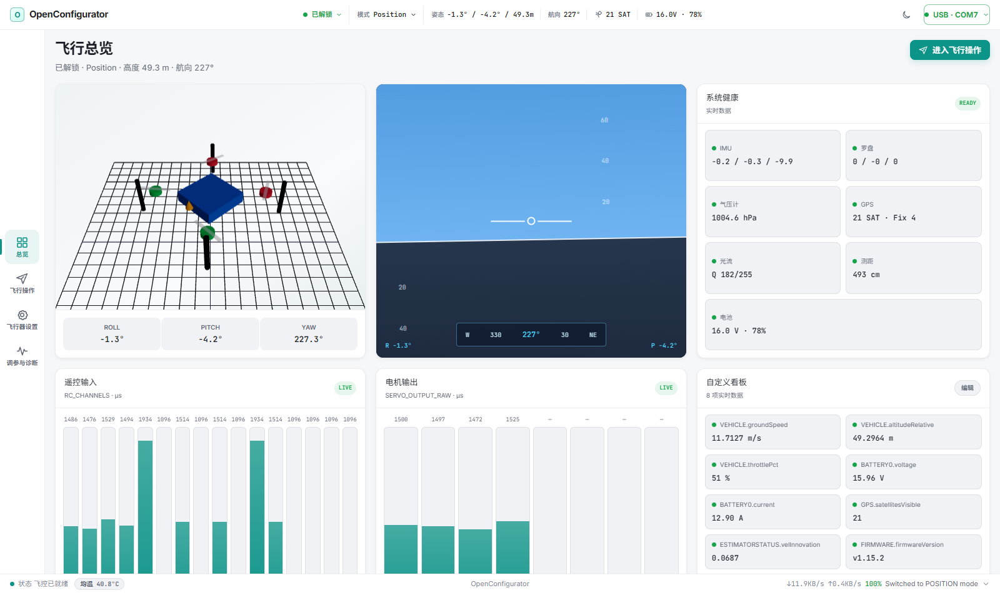

# OpenConfigurator

OpenConfigurator is a local-first, browser-based ground control station for PX4 and ArduPilot. A React SPA talks to a local Node.js service over REST and one WebSocket; the service talks to flight controllers over MAVLink v1/v2 using USB serial or Bluetooth SPP.

[Live demo](https://bakesheep.github.io/OpenConfigurator/) · [中文说明](README.md) · [Architecture](docs/ARCHITECTURE.md) · [Deployment](docs/DEPLOYMENT.md) · [Contributing](CONTRIBUTING.md) · [Security](SECURITY.md)

> [!TIP]
> The [live demo](https://bakesheep.github.io/OpenConfigurator/) is a static, read-only preview: every value is synthetic, there is no backend, no device can be connected, and no write operation is performed.

<p align="center">
  
</p>

> [!WARNING]
> OpenConfigurator is pre-release software, not a certified aviation safety system. Remove all propellers before connecting to motor or ESC controls, and validate changes on real hardware in a controlled environment.

## Features

- USB serial and Windows Bluetooth SPP discovery, reconnect, diagnostics, and target selection
- MAVLink v1/v2 negotiation, optional MAVLink 2 signing, telemetry, parameter sync, and single-controller leasing
- PX4 and ArduPilot identification from HEARTBEAT with profile-specific modes, parameters, capabilities, and safety gates
- Frame and actuator views, sensor calibration, PID/EKF/serial configuration, RC monitoring, gamepad input, and guarded flight commands
- PX4 ULog browsing and analysis; ArduPilot DataFlash listing, download, erase-all, and `.bin` analysis
- AM32 ESC settings over ArduPilot passthrough, PX4 `SERIAL_CONTROL`, or direct 19200-baud serial, including multi-ESC reads, batch writes, and full read-back verification

PX4 is supported across the existing configuration surfaces. ArduCopter 4.7 is the current ArduPilot acceptance target. ArduPlane, Rover, Sub, and Tracker remain read-only for safety-critical operations. ArduPilot compass calibration, frame writes, and mission/fence/rally editing are not implemented.

The ESC page is settings-only: it does not flash firmware or edit startup tones. Its software path recognizes AM32 signatures `0x1F06`, `0x3506`, and `0x1506` with layout revisions 1–3. Check the [hardware validation matrix](docs/ESC-COMPATIBILITY.md) before use; code support is not a hardware-safety guarantee.

## Quick start

Requirements: Node.js `^20.19.0` or `>=22.12.0`, npm, and Chrome or Edge 89+ for the Web Serial picker.

```bash
git clone https://github.com/BakeSheep/OpenConfigurator.git
cd OpenConfigurator
npm install
npm run dev
```

Open <http://localhost:5173>. For a local production build:

```bash
npm ci
npm run build
npm start
```

Then open <http://localhost:3000>. To view synthetic demo data, run `npm run dev:web` and open <http://localhost:5173/?demo=1>.

| Command | Purpose |
|---|---|
| `npm run dev` | Start frontend and backend development servers |
| `npm run typecheck` | Run strict TypeScript checks |
| `npm run test:server` | Run all hardware-free regression tests |
| `npm run test:protocol` | Run MAVLink and ESC protocol tests |
| `npm run build` | Type-check and build the frontend |
| `npm start` | Serve the production application |

## Safety, deployment, and license

The server binds to `127.0.0.1` by default. Remote mode requires explicit opt-in, a strong token, an exact Origin allowlist, and an HTTPS/WSS reverse proxy; see [deployment documentation](docs/DEPLOYMENT.md).

Do not bypass propeller-removal checks, arm confirmation, manual gamepad enablement, controller leasing, or server-side validation. Automated tests do not replace hardware-in-the-loop or flight validation.

OpenConfigurator is licensed under the [MIT License](LICENSE). See [third-party notices](THIRD_PARTY_NOTICES.md) for ESC protocol provenance and license boundaries.
