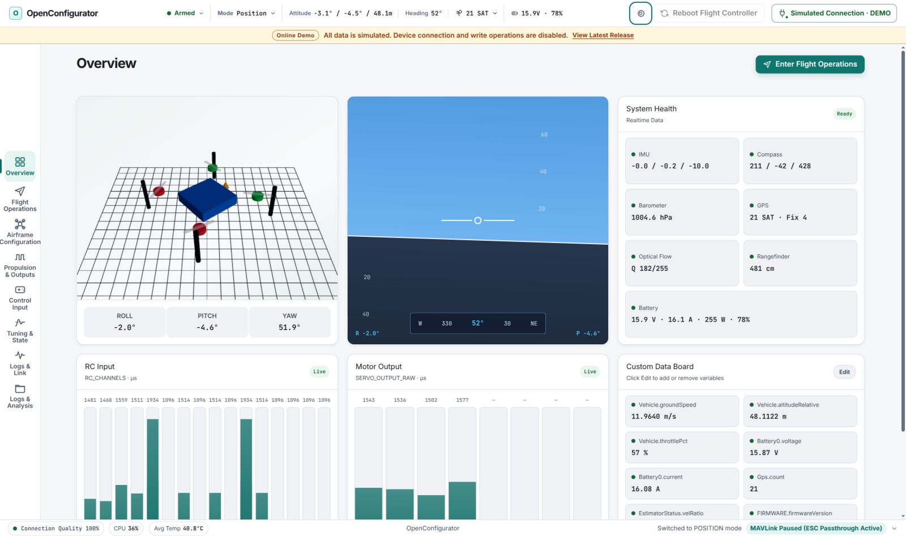

# OpenConfigurator

<p align="center">
  
</p>

<p align="center">
  A local-first desktop and web ground control station for PX4 and ArduPilot.
</p>

<p align="center">
  <a href="https://bakesheep.github.io/OpenConfigurator/"><b>Live demo</b></a> ·
  <a href="https://github.com/BakeSheep/OpenConfigurator/releases/latest"><b>Latest Release</b></a> ·
  <a href="README.md">中文说明</a> ·
  <a href="docs/ARCHITECTURE.md">Architecture</a> ·
</p>

<p align="center">
  
</p>

> [!WARNING]
> OpenConfigurator is pre-release software, not a certified aviation safety system. Remove all propellers before connecting to motor or ESC controls, and validate changes on real hardware in a controlled environment.

## Overview

OpenConfigurator combines a React SPA, a local Node.js service, and an optional Electron desktop shell. The frontend reaches the service through REST plus one WebSocket; the service owns serial, Windows Bluetooth SPP, Linux BlueZ SPP, MAVLink, log transfer, and ESC sessions. It listens on `127.0.0.1` by default, so device data does not need to pass through a cloud service.

The flight controller stack is identified only from HEARTBEAT. PX4 and ArduPilot use separate vehicle profiles, parameters, and command paths; unknown or unadapted vehicle types remain read-only.

## Highlights

- USB serial, Windows Bluetooth SPP, and Linux BlueZ SPP connections with MAVLink v1/v2, link diagnostics, and optional MAVLink 2 signing
- Realtime attitude, position, battery, sensor, RC, actuator, EKF, and MAVLink message monitoring
- Parameter sync and search, QGC parameter-file import/export, airframe selection, radio calibration, flight modes, power/battery and safety setup, PID/EKF tuning, sensor calibration, and serial-port configuration
- Safety-gated arming, mode changes, takeoff, landing, RTL, motor tests, and gamepad RC override
- PX4 ULog and ArduPilot DataFlash browsing, download, offline analysis, chart CSV/PNG export, and complete structured ZIP export
- AM32 ESC settings over ArduPilot passthrough, PX4 `SERIAL_CONTROL`, or direct 19200-baud serial
- The same frontend delivered through a local web service or a portable Windows x64 Electron build

The ESC page configures settings only; it does not flash firmware or edit startup tones. Writes preserve unknown EEPROM bytes and verify the complete block by reading it back. Check the [ESC compatibility matrix](docs/ESC-COMPATIBILITY.md) before use.

## Support boundaries

- PX4: the current connection, monitoring, parameter, tuning, calibration, flight-operation, ULog, and NSH terminal paths are available.
- ArduPilot: ArduCopter is the current adaptation and acceptance target for safety-critical writes. Plane, Rover, Sub, and Tracker can be identified and can show common data and DataFlash logs, but remain read-only.
- Mission, fence, rally-point, camera/gimbal setup, PX4 ESC PWM calibration, and UAVCAN actuator assignment are not currently provided.
- Software paths and automated tests do not mean that a specific flight controller, ESC, and firmware combination has passed HIL or flight validation.

See [flight-controller UI compatibility](docs/FLIGHT-CONTROLLER-COMPATIBILITY.md) and the [ESC compatibility matrix](docs/ESC-COMPATIBILITY.md) for detailed boundaries.

## Workspaces

| Workspace | Main contents |
|---|---|
| Overview | Attitude, key telemetry, system health, and a custom data board |
| Flight Operations | Preflight checks, mode switching, and safety-gated flight commands |
| Vehicle Settings | Airframes, sensors, radio calibration, flight modes, power/battery, safety, EKF, actuators, ESCs, gamepad, and ports |
| Tuning & Diagnostics | Parameters, PID, waveforms, MAVLink messages, flight logs, and structured export |

## Quick start

Node.js `>=22.12.0` and npm are required. The Web Serial picker needs Chrome or Edge 89+ and an HTTPS or localhost page.

Linux Bluetooth uses the BlueZ Profile API and does not require `/dev/rfcomm*` or `sudo rfcomm`. Install `bluez`, Python 3, `dbus-python`, and PyGObject, then pair the SPP device in system Bluetooth settings before connecting.

```bash
git clone https://github.com/BakeSheep/OpenConfigurator.git
cd OpenConfigurator
npm install
npm run dev
```

Open <http://localhost:5173>. Vite proxies `/api` and `/ws` to the local server on port `3000`.

For a local production build:

```bash
npm run build
npm start
```

Open <http://localhost:3000>. To view synthetic demo data only, run `npm run dev:web` and open <http://localhost:5173/?demo=1>.

Common commands:

| Command | Purpose |
|---|---|
| `npm run dev` | Start the frontend and backend development servers |
| `npm run typecheck` | Run TypeScript type checks |
| `npm run test:server` | Run hardware-free regression tests |
| `npm run test:protocol` | Run MAVLink and ESC protocol tests |
| `npm run build` | Type-check and build the production frontend |
| `npm start` | Start the local production service |
| `npm run dist:win` | Build a portable Windows x64 EXE |

## Architecture

```text
Browser / Electron + React SPA
             │ REST + WebSocket
             ▼
Express / ws ── validation / controller lease
             │
             ├─ MAVLink bridge ── PX4 / ArduPilot
             └─ ESC service ───── passthrough / SERIAL_CONTROL / direct serial
```

- `src/shared/` is the only frontend/backend shared boundary and contains protocol types, vehicle profiles, and ESC layouts.
- `src/web/` contains the React workspaces, WebSocket dispatch, and Zustand stores.
- `src/server/` owns connection lifecycle, MAVLink, log transfer, and ESC sessions.

See the [architecture document](docs/ARCHITECTURE.md) for detailed design and constraints.

## Documentation and license

- [Architecture](docs/ARCHITECTURE.md)
- [Flight-controller UI compatibility](docs/FLIGHT-CONTROLLER-COMPATIBILITY.md)
- [Vehicle configuration behavior and parameter sources](docs/VEHICLE-CONFIG-SOURCES.md)
- [Parameter enum metadata](docs/PARAMETER-ENUM-METADATA.md)
- [Structured flight logs](docs/STRUCTURED-FLIGHT-LOG.md)
- [ESC compatibility](docs/ESC-COMPATIBILITY.md)
- [ESC protocol sources](docs/ESC-PROTOCOL-SOURCES.md)
- [Third-party notices](THIRD_PARTY_NOTICES.md)

OpenConfigurator is licensed under the [MIT License](LICENSE). The project is not affiliated with PX4, ArduPilot, MAVLink, MicoAir, or QGroundControl.
