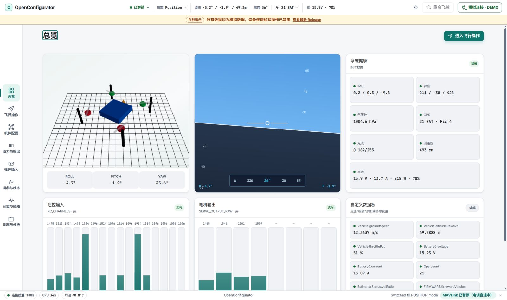

# OpenConfigurator

<p align="center">
  
</p>

<p align="center">
  面向 PX4 与 ArduPilot 的本地优先桌面与 Web 地面站。
</p>

<p align="center">
  <a href="https://bakesheep.github.io/OpenConfigurator/"><b>在线预览</b></a> ·
  <a href="README.en.md">English</a> ·
  <a href="docs/ARCHITECTURE.md">架构</a> ·
</p>

<p align="center">
  
</p>

> [!WARNING]
> OpenConfigurator 仍处于预发布阶段，不是经过认证的航空安全系统。连接电机或 ESC 控制前必须拆除全部螺旋桨，并在受控环境中完成实机验证。

## 项目概览

OpenConfigurator 由 React 单页应用、本机 Node.js 服务和可选的 Electron 桌面壳组成。前端通过 REST 与单一 WebSocket 访问服务；服务负责串口、Windows Bluetooth SPP、Linux BlueZ SPP、MAVLink、日志传输和 ESC 会话。默认服务仅监听 `127.0.0.1`，设备数据无需经过云端。

飞控类型只根据 HEARTBEAT 识别。PX4 与 ArduPilot 使用各自的 vehicle profile、参数和指令路径；未识别或尚未适配的机型保持只读。

界面按八个任务域组织，桌面与移动端共用同一套路由。浏览器重连后会恢复连接、控制权和当前 MAVLink 目标状态，并在目标与权限就绪后自动继续参数同步。

## 主要功能

- USB 串口、Windows Bluetooth SPP 与 Linux BlueZ SPP 连接，支持连接预设、硬件身份重新匹配、MAVLink v1/v2、链路诊断和可选的 MAVLink 2 signing
- 姿态、定位、电池、传感器、RC、执行器、EKF 和 MAVLink 消息实时监控
- 参数自动同步与进度显示、搜索、QGC 参数文件导入/导出、机架选择、遥控器校准、飞行模式、电源/电池、安全保护、PID/EKF 调整与独立传感器校准页
- PID 参数写入会实时复核飞控就绪、已上锁、机型支持与当前客户端控制权，并等待参数回显后确认写入
- 带安全门控的解锁/上锁、模式切换、起飞、降落、返航、电机测试和手柄 RC override
- PX4 ULog 与 ArduPilot DataFlash 日志浏览、下载、离线分析、可用时基于 GPS 的绝对起飞时间、图表 CSV/PNG 与完整结构化 ZIP 导出
- 通过 ArduPilot passthrough、PX4 `SERIAL_CONTROL` 或 19200 波特直连配置 AM32 ESC 参数
- 同一套前端支持本地 Web 运行和 Windows x64 Electron 免安装包

ESC 页面只配置参数，不提供固件刷写或启动音编辑。写入会保留未知 EEPROM 字节并执行完整读回校验；实际使用前请核对 [ESC 兼容性矩阵](docs/ESC-COMPATIBILITY.md)。

## 支持边界

- PX4：覆盖当前已有的连接、监控、参数、调参、校准、飞行操作、ULog 和 NSH 终端路径。
- ArduPilot：ArduCopter 是当前安全关键写操作的适配与验收目标；Plane、Rover、Sub 和 Tracker 可识别并查看通用数据与 DataFlash 日志，但保持只读。
- 当前不提供任务、围栏、集结点、相机/云台配置、PX4 ESC PWM 校准或 UAVCAN 执行器分配。
- 软件路径和自动化测试不等于具体飞控、ESC、固件组合已通过 HIL 或飞行验证。

详细边界见 [飞控配置界面兼容性](docs/FLIGHT-CONTROLLER-COMPATIBILITY.md) 和 [ESC 兼容性矩阵](docs/ESC-COMPATIBILITY.md)。

## 工作区

| 工作区 | 主要内容 |
|---|---|
| 总览 | 姿态、关键遥测、系统健康与自定义数据板 |
| 飞行操作 | 预检、模式切换与带安全门控的飞行指令 |
| 机体配置 | 机架、传感器实时诊断、独立校准、电源/电池与安全保护 |
| 动力与输出 | 执行器映射、无桨电机测试与 AM32 ESC 参数配置 |
| 遥控输入 | 遥控器校准、手柄输入与飞行模式分配 |
| 调参与状态 | 完整参数、PID 调参与 EKF 融合状态 |
| 日志与链路 | MAVLink 消息、消息频率、飞控终端与实时波形 |
| 日志与分析 | 飞行日志列表、下载、离线分析与结构化导出 |

## 快速开始

要求 Node.js `>=22.12.0` 与 npm。Web Serial 设备选择器需要 Chrome / Edge 89+，且页面通过 HTTPS 或 localhost 访问。

Linux 蓝牙直连使用 BlueZ Profile API，不需要创建 `/dev/rfcomm*` 或执行 `sudo rfcomm`；系统需安装 `bluez`、Python 3、`dbus-python` 与 PyGObject，并先在系统蓝牙设置中完成 SPP 设备配对。

```bash
git clone https://github.com/BakeSheep/OpenConfigurator.git
cd OpenConfigurator
npm install
npm run dev
```

打开 <http://localhost:5173>。Vite 会将 `/api` 与 `/ws` 代理到本机 `3000` 端口。

本地生产模式：

```bash
npm run build
npm start
```

打开 <http://localhost:3000>。只查看合成数据演示时，可运行 `npm run dev:web` 并访问 <http://localhost:5173/?demo=1>。

常用命令：

| 命令 | 用途 |
|---|---|
| `npm run dev` | 同时启动前端与后端开发服务 |
| `npm run typecheck` | 运行 TypeScript 类型检查 |
| `npm run test:server` | 运行硬件无关回归测试 |
| `npm run test:protocol` | 运行 MAVLink 与 ESC 协议专项测试 |
| `npm run build` | 检查类型并构建生产前端 |
| `npm start` | 启动本地生产服务 |
| `npm run dist:win` | 构建 Windows x64 portable EXE |

## 架构

```text
Browser / Electron + React SPA
             │ REST + WebSocket
             ▼
Express / ws ── validation / controller lease
             │
             ├─ MAVLink bridge ── PX4 / ArduPilot
             └─ ESC service ───── passthrough / SERIAL_CONTROL / direct serial
```

- `src/shared/`：前后端唯一共享边界，包含协议类型、vehicle profile 与 ESC 布局
- `src/web/`：React 工作区、WebSocket 分发和 Zustand stores
- `src/server/`：连接生命周期、MAVLink、日志传输和 ESC 会话

详细设计与约束见 [架构文档](docs/ARCHITECTURE.md)。

## 文档与许可

- [架构](docs/ARCHITECTURE.md)
- [飞控配置界面兼容性](docs/FLIGHT-CONTROLLER-COMPATIBILITY.md)
- [飞行器配置行为与参数来源](docs/VEHICLE-CONFIG-SOURCES.md)
- [参数枚举元数据](docs/PARAMETER-ENUM-METADATA.md)
- [结构化飞行日志](docs/STRUCTURED-FLIGHT-LOG.md)
- [ESC 兼容性](docs/ESC-COMPATIBILITY.md)
- [ESC 协议来源](docs/ESC-PROTOCOL-SOURCES.md)
- [第三方说明](THIRD_PARTY_NOTICES.md)

OpenConfigurator 采用 [MIT License](LICENSE)。项目与 PX4、ArduPilot、MAVLink、MicoAir 或 QGroundControl 官方项目没有隶属关系。
