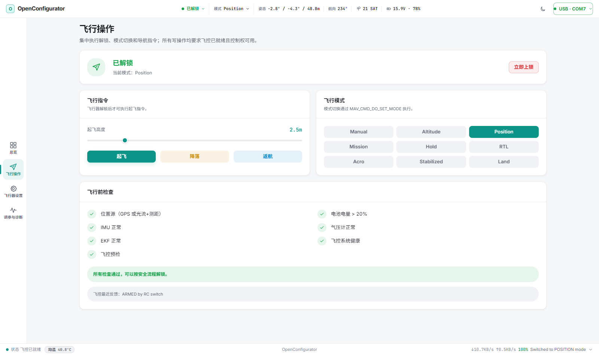
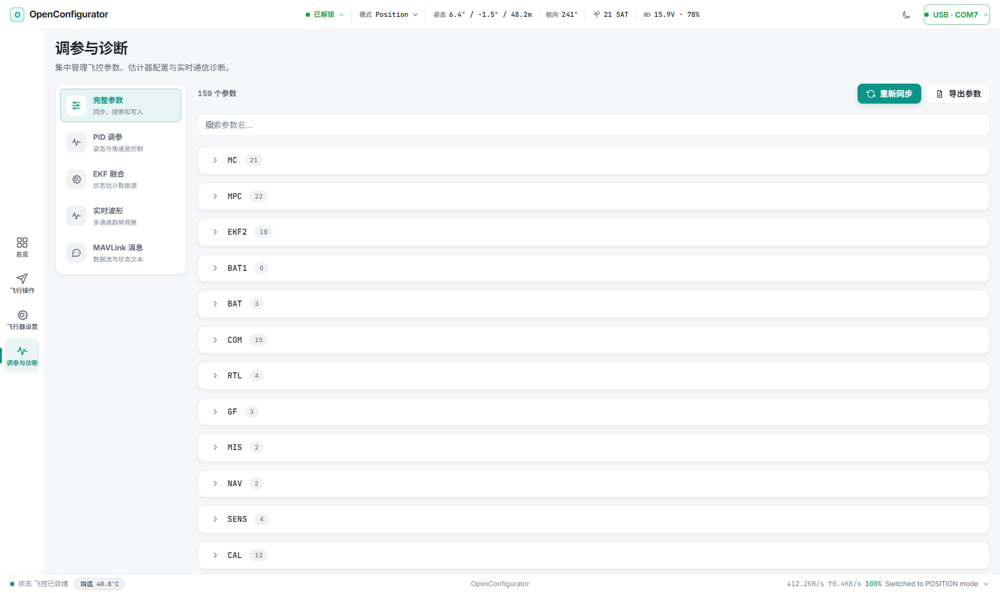
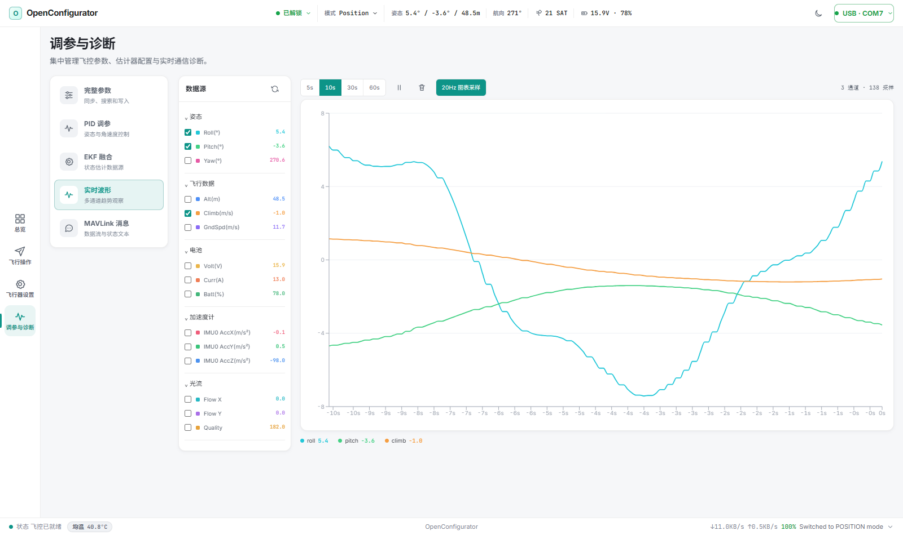
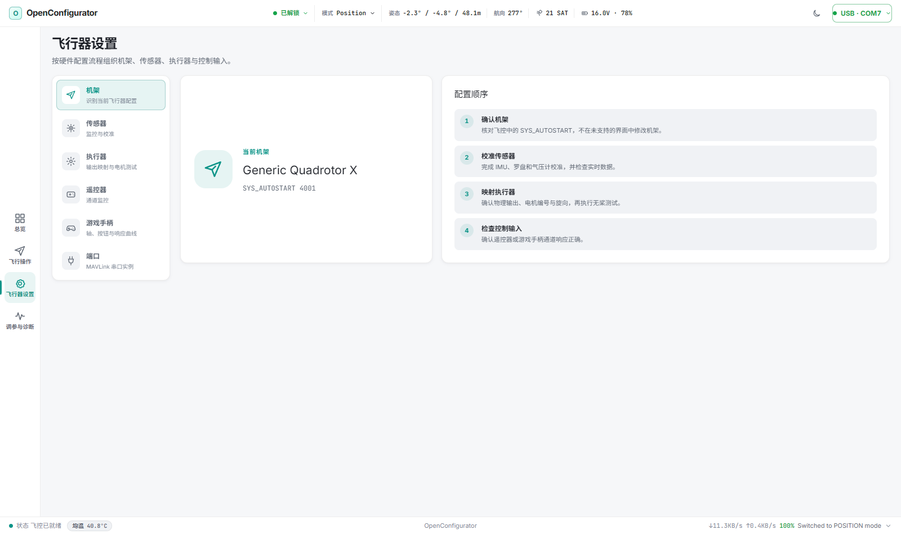

# OpenConfigurator

<p align="center">
  
</p>

<p align="center">
  面向 PX4 与 ArduPilot 的本地优先桌面与 Web 地面站，在 Windows 桌面端或浏览器中完成连接、监控、参数配置、调参与基础飞行操作。
</p>

<p align="center">
  <a href="https://bakesheep.github.io/OpenConfigurator/"><b>在线预览</b></a> ·
  <a href="https://github.com/BakeSheep/OpenConfigurator/releases/latest"><b>最新 Release</b></a> ·
  <a href="README.en.md">English</a> ·
  <a href="docs/ARCHITECTURE.md">架构</a> ·
  <a href="CHANGELOG.md">变更记录</a> ·
  <a href="CONTRIBUTING.md">参与贡献</a> ·
  <a href="THIRD_PARTY_NOTICES.md">第三方说明</a>
</p>

> [!TIP]
> [在线预览](https://bakesheep.github.io/OpenConfigurator/) 是纯静态的只读演示：所有数据均为合成数据，没有后端服务，不能连接真实设备，也不会执行任何写操作。桌面安装包请前往 [最新 Release](https://github.com/BakeSheep/OpenConfigurator/releases/latest) 下载。

<p align="center">
  
</p>

> [!WARNING]
> OpenConfigurator 仍处于 pre-release 阶段，不是经过认证的航空安全系统。连接真实飞行器或电调前必须拆除全部螺旋桨，并在受控环境中完成硬件验证。自动化测试不能替代实机与飞行验证。

## 项目简介

OpenConfigurator 由 React 单页应用、本机 Node.js 服务和可选的 Electron 桌面壳组成。浏览器或桌面端通过 REST 与单一 WebSocket 连接服务，服务通过 USB 串口或 Bluetooth SPP 与飞控交换 MAVLink v1/v2 数据。服务默认只监听 `127.0.0.1`；浏览器远程访问必须显式启用鉴权与 Origin 白名单，桌面版始终使用本机随机端口。

OpenConfigurator 根据 HEARTBEAT 自动识别 PX4 与 ArduPilot。飞控差异由 vehicle profile 隔离，未知或尚未适配的机型默认只读，避免把另一套飞控的模式、参数或命令写入设备。

## 当前功能

### 连接与遥测

- USB 串口与 Windows Bluetooth SPP 扫描、连接、重连和链路诊断
- MAVLink v1/v2 自动协商、目标飞控选择、链路统计与可选 MAVLink 2 signing
- 姿态、GPS、电池、IMU、磁罗盘、气压计、光流、测距、RC、执行器和 EKF 实时数据
- 多客户端只读观察、单控制者租约、REST/WS 输入校验与危险操作服务端门控

### 飞控配置与操作

- 完整参数同步、搜索、分组、修改、回显确认与导出
- 机架识别、执行器映射、传感器监控与校准、PID、EKF、串口和板载朝向配置
- 带确认保护的解锁/上锁、起飞、降落、返航、模式切换和无桨电机测试
- RC 通道监控、游戏手柄映射与必须手动启用的 RC override
- PX4 ULog 浏览、下载、删除与分析；ArduPilot DataFlash `.bin` 列表、下载、整库擦除与分析

### PX4 与 ArduPilot

| 能力 | PX4 | ArduPilot |
|---|---|---|
| 识别与通用遥测 | 支持 | 支持 |
| 参数、PID、EKF、端口 | 支持 | ArduCopter 支持 |
| 模式与飞行操作 | 支持 | ArduCopter 支持 |
| 机架与执行器 | 支持 | ArduCopter 支持 |
| 电机测试 | `MAV_CMD_ACTUATOR_TEST` | `MAV_CMD_DO_MOTOR_TEST` |
| 飞行日志 | ULog / MAVLink FTP | DataFlash / `LOG_REQUEST_*` |

ArduCopter 4.7 是当前 ArduPilot 实机验收目标。ArduPlane、Rover、Sub 与 Tracker 可识别并显示通用数据与 DataFlash 日志，但安全关键写操作仍为只读。ArduPilot 罗盘校准、机架写入和任务/围栏/集结点编辑尚未实现。

### ESC 参数配置

“飞行器设置 → 电调”提供 AM32 参数配置，不提供固件刷写或启动音编辑：

- ArduPilot BLHeli passthrough、PX4 `SERIAL_CONTROL` 与 19200 波特 USB 单线直连
- 最多 8 个 ESC 的发现、身份显示、EEPROM 读取、分组编辑与批量写入
- 写入前范围校验、未知字节保留、写后整块读回比对、任务取消和断线会话恢复
- 软件路径覆盖 AM32 MCU signature `0x1F06`、`0x3506`、`0x1506` 与 layout revision 1–3

软件支持不等于具体飞控、ESC 和固件组合已经通过实机验证。使用前请核对 [ESC 参数兼容性矩阵](docs/ESC-COMPATIBILITY.md)；BLHeli_S、Bluejay、未知 signature 或未知 layout 不开放参数写入。

### 桌面运行

Electron 桌面壳复用同一套 React 前端与 Node.js 服务，当前提供 Windows x64 免安装 portable 预发布包。桌面版不会读取可能扩大监听范围的远程部署环境变量，也不要求最终用户另外安装 Node.js 或 npm。

## 界面

项目包含四个一级工作区：

| 工作区 | 内容 |
|---|---|
| 总览 | 姿态、飞行状态、关键遥测与系统健康 |
| 飞行操作 | 飞行前检查、模式切换和带安全确认的飞行命令 |
| 飞行器设置 | 机架、传感器、执行器、ESC、接收机、手柄与端口 |
| 调参与诊断 | 参数、PID、EKF、波形、MAVLink 消息与飞行日志 |

以下截图来自开发演示模式，数据均为合成数据：

| 飞行操作 | 调参与诊断 |
|---|---|
|  |  |

| 实时波形 | 飞行器设置 |
|---|---|
|  |  |

## 快速开始

开发和构建环境要求：

- Node.js `>=22.12.0`
- npm
- 推荐 Chrome / Edge 89+；Web Serial 设备选择器仅能在 HTTPS 或 localhost 使用

```bash
git clone https://github.com/BakeSheep/OpenConfigurator.git
cd OpenConfigurator
npm install
npm run dev
```

打开 <http://localhost:5173>。Vite 将 `/api` 与 `/ws` 代理到本机 `3000` 端口。

本地生产模式：

```bash
npm ci
npm run build
npm start
```

打开 <http://localhost:3000>。只查看界面时可运行 `npm run dev:web`，然后访问 <http://localhost:5173/?demo=1>（与在线预览相同的合成数据演示）。

### Windows 桌面预发布版

桌面包内置 Electron/Node.js 运行时，最终用户无需安装 Node.js 或 npm。当前桌面预发布版本为 `1.0.0-beta.1`，仅构建 Windows x64 免安装 portable EXE：

```bash
npm ci
npm run dist:win
```

产物位于 `release/`，文件名以 `-portable.exe` 结尾。仅生成解包目录用于快速验证时运行 `npm run dist:win:dir`；开发环境启动桌面窗口可运行 `npm run desktop`。

桌面版只在随机分配的 `127.0.0.1` 端口启动内置服务，不读取会扩大监听范围的远程部署环境变量。正式发布前仍需完成目标 Windows 版本、USB/蓝牙串口和飞控硬件验证，并建议对 EXE 进行代码签名。

| 命令 | 用途 |
|---|---|
| `npm run dev` | 同时启动前端和后端开发服务 |
| `npm run dev:web` | 仅启动 Vite 前端 |
| `npm run dev:server` | 仅启动 Node.js 后端 |
| `npm run typecheck` | 严格 TypeScript 类型检查 |
| `npm run test:server` | 运行全部硬件无关回归测试 |
| `npm run test:protocol` | 运行 MAVLink 与 ESC 协议专项测试 |
| `npm run test:desktop` | 启动解包桌面版并验证 React、脚本和样式实际加载 |
| `npm run build` | 类型检查并生成生产前端 |
| `npm run build:desktop` | 构建生产前端与 Electron 主进程 |
| `npm run desktop` | 构建并启动 Electron 桌面开发实例 |
| `npm run dist:win` | 生成 Windows x64 portable EXE |
| `npm start` | 启动生产服务 |

## 架构

```text
Browser / Electron + React SPA
             │ REST + WebSocket
             ▼
Express / ws ── validation / controller lease
             │
             ├─ MAVLink bridge ── PX4 / ArduPilot
             └─ ESC service ───── passthrough / SERIAL_CONTROL / direct serial
```

- `src/shared/`：前后端唯一共享边界，包含协议、vehicle profile 与 ESC 类型
- `src/web/`：React 页面、组件、WebSocket 分发和 Zustand stores
- `src/server/`：HTTP/WS 边界、连接生命周期、MAVLink、日志传输与 ESC 会话
- `src/server/mavlink/codec.ts`：唯一 MAVLink framing、CRC 与 signing 入口
- `electron/main.ts`：桌面入口，启动本机服务并加载打包后的前端资源

详细约束见 [架构文档](docs/ARCHITECTURE.md)。

## 安全底线与限制

- 电机测试、ESC 读取或写入前必须拆除全部螺旋桨。
- 解锁保留二次确认；游戏手柄 RC override 必须由操作者手动启用。
- `transportOpen` 只表示串口已打开；收到目标飞控有效心跳后才是 `vehicleReady`。
- ESC 会话会独占控制权；写入期间不得断开飞控或 ESC 供电。
- 远程模式必须使用 HTTPS/WSS、强随机 token、精确 Origin 白名单和网络隔离。
- 未列明或未做实机验证的组合不构成兼容性、适航性或飞行安全承诺。

## 文档、贡献与许可

- [架构](docs/ARCHITECTURE.md)
- [ESC 参数兼容性](docs/ESC-COMPATIBILITY.md)
- [ESC 协议来源](docs/ESC-PROTOCOL-SOURCES.md)
- [贡献指南](CONTRIBUTING.md)
- [第三方说明](THIRD_PARTY_NOTICES.md)

OpenConfigurator 采用 [MIT License](LICENSE)。第三方协议与许可证说明见 [THIRD_PARTY_NOTICES.md](THIRD_PARTY_NOTICES.md)。项目与 PX4、ArduPilot、MAVLink、MicoAir 或 QGroundControl 官方项目没有隶属关系。
