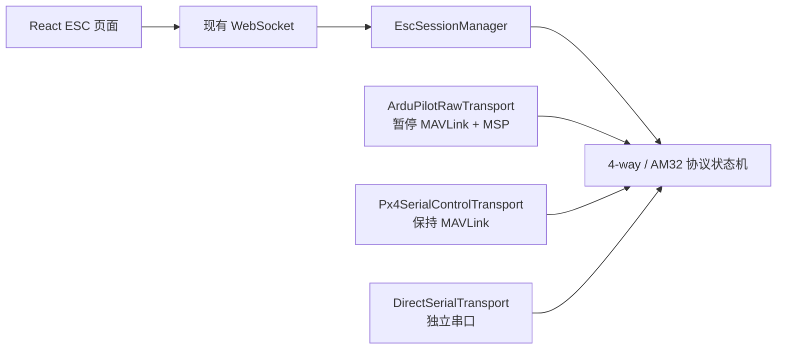

# ESC 电调配置功能集成 Implementation Plan

> **For Claude:** REQUIRED SUB-SKILL: Use superpowers:executing-plans to implement this plan task-by-task.

**Goal:** 在 OpenConfigurator 中新增安全、可验证的 ESC 配置能力，支持通过 ArduPilot passthrough、PX4 MAVLink `SERIAL_CONTROL` 和独立 USB 串口访问 AM32，并在完成真实硬件验证后逐步支持 AM32 刷写、BLHeli_S、Bluejay 和启动音编辑。

**Architecture:** 所有有严格时序要求的 ESC 协议状态机均运行在 Node.js 后端，前端只发送高层意图并接收快照式状态。后端以统一的 `EscByteTransport` 接口屏蔽三种物理链路：ArduPilot raw MSP/4-way、PX4 MAVLink `SERIAL_CONTROL`、独立半双工串口；EEPROM layout、RTTTL 和编解码纯函数位于 `src/shared/esc/`。任何来源不明或许可证不允许复用的参考实现不得复制，只做经过记录的功能兼容实现。

**Tech Stack:** React 19、TypeScript、Vite、zustand、Node.js、Express、ws、serialport、node-mavlink、`tsx --test`

---

## 1. 范围、约束和非目标

### 1.1 首版范围

- AM32 ESC 发现、识别和只读信息展示。
- AM32 已验证 EEPROM revision 的设置读取、编辑、写入和回读校验。
- 三种连接后端：
  - ArduPilot：同一飞控 COM 口切换到 MSP/4-way passthrough。
  - PX4：保持 MAVLink 会话，通过 `SERIAL_CONTROL` 访问 ESC 通道 20–27。
  - Direct：独立 USB 串口适配器直连 AM32 ESC。
- 完成硬件在环验证后开放 AM32 本地固件刷写。
- 后续增加 GitHub 固件目录、BLHeli_S、Bluejay 和 RTTTL 启动音。

### 1.2 安全约束

- 只有在“已确认未解锁”的状态下才能进入飞控 passthrough。
- `armed === true`、`armed === null`、心跳过期或状态正在转换时一律拒绝。
- 未识别 EEPROM revision 只能读取原始数据，禁止写入。
- 固件目标 MCU、地址范围、bootloader 禁写区、固件 target 和 SHA-256 全部校验通过后才能刷写。
- 批量刷写中任意一颗失败时默认暂停整个批次，不自动继续。
- `cancel` 采用延迟取消：只在完成当前安全原子操作后生效，不得在 page erase/write 中途打断。
- WS 断开不立即中断当前写页；会话进入 `orphaned`，在安全边界等待恢复或退出。
- ESC 会话激活期间禁止参数写入、FTP、日志下载、飞行命令、手动控制和现有电机测试。

### 1.3 非目标

- 首版不支持 BLHeli_32。
- 首版不支持 DroneCAN ESC。
- 首版不新增 MSP 电机测试；继续使用现有 `MotorPage` 和飞控原生命令。
- 不直接复制 `am32-configurator` 中没有明确许可证的源码。
- 不直接把 AGPL `esc-configurator` 源码合并到 MIT 主程序。
- 不承诺“所有 AM32/BLHeli_S/Bluejay revision 全量兼容”；只支持兼容性矩阵中已验证的组合。

## 2. 关键架构决策

### ADR-001：功能兼容，不移植来源不清晰的实现

**Decision:** 新增 `docs/ESC-PROTOCOL-SOURCES.md` 和 `THIRD_PARTY_NOTICES.md`，记录命令码、layout offset、测试向量和固件资源的来源及许可证。没有明确许可的参考代码只能用于理解外部行为，不允许逐行翻译或复制。

**Trade-off:** 初期实现和验证速度较慢，但 OpenConfigurator 可以继续采用 MIT 许可证，并具备可审计的代码来源。

### ADR-002：统一字节传输接口，协议状态机与链路解耦



```ts
export interface EscByteTransport {
  readonly kind: 'ardupilot_raw' | 'px4_serial_control' | 'direct'
  readonly capabilities: EscTransportCapabilities
  open(target: EscTransportTarget, signal: AbortSignal): Promise<void>
  transact(
    request: Uint8Array,
    options: EscTransactionOptions,
    signal: AbortSignal,
  ): Promise<Uint8Array>
  close(reason: string): Promise<void>
}
```

**Decision:** `fourWay.ts`、AM32 设置读写和刷写任务只能依赖 `EscByteTransport`，不得直接依赖 `ConnectionManager`、`MavlinkBridge` 或 `SerialConnection`。

**Trade-off:** 比单一 raw session 多三个适配器，但避免将 ArduPilot 的链路切换方式错误套用到 PX4。

### ADR-003：平台采用不同 passthrough 机制

| 平台 | 机制 | MAVLink 是否暂停 | 前置条件 |
|---|---|---:|---|
| ArduPilot | 同一 COM 口发送 MSP，进入 4-way | 是 | DShot；`SERVO_BLH_AUTO=1` 或正确的 `SERVO_BLH_MASK`；USB 串口 |
| PX4 | MAVLink `SERIAL_CONTROL`，device 20–27 | 否 | F7/H7；固件含 serialpassthrough/bitbang；`PASSTHRU_EN=1` 并重启 |
| Direct | 独立 USB 串口，AM32 半双工单线 | 不影响现有 MAVLink | 目标端口不得与飞控端口相同；19200 baud |

### ADR-004：ESC 会话拥有独立所有权

```ts
type EscSessionState =
  | { state: 'idle' }
  | { state: 'entering'; sessionId: string; ownerClientId: string }
  | { state: 'active'; sessionId: string; ownerClientId: string; mode: EscSessionMode }
  | { state: 'orphaned'; sessionId: string; recoverUntil: number; jobId?: string }
  | { state: 'exiting'; sessionId: string; reason: string }
```

- 启动会话时生成 `sessionId` 和服务器签发的恢复令牌。
- controller lease 在会话期间由服务端固定给 owner。
- observer 可以接收状态广播，但不能提交 ESC 命令。
- owner 断开时进入 `orphaned`；没有 active job 时立即安全退出，有 active job 时完成当前安全原子单元后等待恢复。
- `release_control` 在 ESC 会话激活时拒绝。
- active job 期间暂停普通 60 秒空闲看门狗。

### ADR-005：恢复 MAVLink 必须经过真实 readiness 边沿

- ArduPilot raw session 开始时显式把 `vehicleReady` 置为 `false` 并广播快照。
- 退出 raw session 后重新挂载 MAVLink codec，但仍保持 `vehicleReady=false`。
- 只有收到新的、验证通过的已选飞控心跳后才恢复 `vehicleReady=true`。
- 不直接调用或“复放”原本只处理真实连接事件的 `onStatusChange('connected')`。
- 前端现有 `false → true` 边沿继续负责重新下载参数。

### ADR-006：刷写采用可恢复状态机

```ts
type FlashPhase =
  | 'preflight'
  | 'backup'
  | 'erase_page'
  | 'write_page'
  | 'verify_page'
  | 'verify_image'
  | 'reset'
  | 'paused'
  | 'done'
  | 'failed'
```

- `cancelRequested` 只在 `verify_page`、`verify_image` 或颗粒边界生效。
- 当前颗失败后进入 `paused`，等待用户选择重试、明确跳过或退出。
- 断线时不得声称“继续完成刷写”；只有物理链路仍存在、仅 WS owner 断开时才允许完成当前安全原子单元。
- 物理串口/MAVLink 链路断开立即标记失败，并保存最后确认完成的页。

## 3. 协议和 WebSocket 边界

### 3.1 ClientMessage

```ts
type EscClientMessage =
  | {
      type: 'esc_session_start'
      requestId?: string
      data:
        | { mode: 'ardupilot_passthrough' }
        | { mode: 'px4_serial_control'; channels: number[] }
        | { mode: 'direct'; port: string; baudRate?: 19200 }
    }
  | { type: 'esc_session_reclaim'; requestId?: string; data: { sessionId: string; recoveryToken: string } }
  | { type: 'esc_session_exit'; requestId?: string; data: { sessionId: string } }
  | { type: 'esc_devices_scan'; requestId?: string; data: { sessionId: string } }
  | { type: 'esc_settings_read'; requestId?: string; data: { sessionId: string; targets: number[] | 'all' } }
  | {
      type: 'esc_settings_write'
      requestId?: string
      data: { sessionId: string; targets: number[]; values: Record<string, unknown> }
    }
  | {
      type: 'esc_flash_start'
      requestId?: string
      data: {
        sessionId: string
        targets: number[]
        assetId: string
        safetyConfirmation: 'flash_esc_props_removed'
      }
    }
  | { type: 'esc_flash_cancel'; requestId?: string; data: { sessionId: string; jobId: string } }
  | {
      type: 'esc_flash_decide'
      requestId?: string
      data: { sessionId: string; jobId: string; decision: 'retry_current' | 'skip_current' | 'exit' }
    }
  | { type: 'esc_melody_write'; requestId?: string; data: { sessionId: string; targets: number[]; rtttl: string } }
```

### 3.2 ServerMessage

```ts
type EscServerMessage =
  | { type: 'esc_session'; data: EscSessionSnapshot }
  | { type: 'esc_devices'; data: { sessionId: string; escs: EscDeviceInfo[] } }
  | { type: 'esc_settings'; data: EscSettingsSnapshot }
  | { type: 'esc_job_progress'; data: EscJobProgressSnapshot }
  | { type: 'esc_job_done'; data: EscJobResult }
  | { type: 'esc_op_error'; data: EscOperationError }
  | { type: 'esc_log'; data: { sessionId: string; entries: EscLogEntry[] } }
```

### 3.3 边界规则

- 所有 `esc_*` 客户端命令都必须通过 `parseClientMessage` 白名单校验。
- 所有 ESC 命令都要求当前客户端是 session owner；读取也不能由 observer 发起。
- `esc_session_start` 必须持有 controller lease。
- direct 启动消息在没有飞控连接时也允许，但仍需 controller lease。
- ESC 消息必须在通用 `requiresReadyTarget` 判断之前由 ESC 路由器判定：
  - ArduPilot/PX4 start 要求 ready target。
  - Direct start 不要求 ready target。
  - 已激活 session 的后续命令依据 session 自身状态判断。
- 进度事件是绝对快照、允许丢帧，广播频率不超过 4Hz。
- 日志以 500ms 批量发送，服务端和前端各限制为 500 条 ring buffer。

## 4. 实施任务

### Task 1：建立许可证、来源与兼容性基线

**Files:**
- Create: `docs/ESC-PROTOCOL-SOURCES.md`
- Create: `docs/ESC-COMPATIBILITY.md`
- Create: `THIRD_PARTY_NOTICES.md`
- Modify: `README.md`

**Step 1: 建立来源记录模板**

为每个命令码、EEPROM 字段、CRC、固件目录和测试向量记录：

```md
| Item | Value/Range | Source | License | Used as | Verified by |
|---|---|---|---|---|---|
| CRC16-XMODEM | poly 0x1021 | Public standard | N/A | Independent implementation | Golden vector + device |
```

**Step 2: 建立兼容性矩阵**

矩阵至少包含平台、飞控板、飞控版本、ESC MCU、固件版本、layout revision、连接方式、读取、写入、刷写和验证日期。

**Step 3: 标注当前状态**

所有尚未经过真实硬件验证的组合标为 `planned`，不能标为 `supported`。

**Step 4: 更新 README**

说明 ESC 功能仅覆盖兼容性矩阵中的已验证组合，并加入无桨和断电风险警告。

**Step 5: Commit**

```bash
git add docs/ESC-PROTOCOL-SOURCES.md docs/ESC-COMPATIBILITY.md THIRD_PARTY_NOTICES.md README.md
git commit -m "docs: define ESC protocol provenance and compatibility policy"
```

### Task 2：定义 shared 类型、错误和纯函数边界

**Files:**
- Create: `src/shared/esc/types.ts`
- Create: `src/shared/esc/errors.ts`
- Create: `src/shared/esc/crc.ts`
- Create: `src/shared/esc/crc.test.ts`
- Create: `src/shared/esc/index.ts`
- Modify: `src/shared/types.ts`

**Step 1: 写 CRC 失败测试**

```ts
assert.equal(crc16Xmodem(new TextEncoder().encode('123456789')), 0x31c3)
```

**Step 2: 运行测试确认失败**

Run:

```bash
npx tsx --test src/shared/esc/crc.test.ts
```

Expected: FAIL，因为 `crc16Xmodem` 尚不存在。

**Step 3: 实现最小 CRC 和 shared 类型**

类型包含：

- `EscDeviceInfo`
- `EscSessionMode`
- `EscSessionSnapshot`
- `EscSettingsField`
- `EscSettingsSnapshot`
- `EscJobProgressSnapshot`
- `EscOperationError`
- `EscTransportCapabilities`

**Step 4: 运行测试和类型检查**

```bash
npx tsx --test src/shared/esc/crc.test.ts
npx tsc --noEmit
```

Expected: PASS。

**Step 5: Commit**

```bash
git add src/shared/esc src/shared/types.ts
git commit -m "feat: add shared ESC protocol types and CRC"
```

### Task 3：建立 EscByteTransport 和会话所有权状态机

**Files:**
- Create: `src/server/esc/EscByteTransport.ts`
- Create: `src/server/esc/EscSessionManager.ts`
- Create: `src/server/esc/EscSessionManager.test.ts`
- Modify: `src/server/index.ts`

**Step 1: 编写状态机失败测试**

覆盖：

- 同一时间只能有一个 session。
- 非 owner 不能发起 scan/read/write/exit。
- owner WS 断开且无任务时安全退出。
- owner WS 断开且有任务时进入 `orphaned`。
- reclaim token 错误时拒绝。
- `release_control` 在 active session 时拒绝。
- session 结束恰好调用一次 transport `close()`。

**Step 2: 运行测试确认失败**

```bash
npx tsx --test src/server/esc/EscSessionManager.test.ts
```

**Step 3: 实现最小状态机**

使用 generation 防止旧 transport 回调改变新 session。所有退出路径收敛到一个幂等 `finalizeSession(reason)`。

**Step 4: 接入 controller lease**

新增服务端方法：

```ts
pinControllerToEscSession(ownerClientId: string, sessionId: string): void
releaseEscSessionController(sessionId: string): void
```

ESC session 存在时不允许 lease 过期或被其他客户端接管。

**Step 5: 运行测试**

```bash
npx tsx --test src/server/esc/EscSessionManager.test.ts
npx tsc --noEmit
```

**Step 6: Commit**

```bash
git add src/server/esc/EscByteTransport.ts src/server/esc/EscSessionManager.ts src/server/esc/EscSessionManager.test.ts src/server/index.ts
git commit -m "feat: add owned ESC session state machine"
```

### Task 4：实现安全的 ArduPilot raw session 生命周期

**Files:**
- Modify: `src/server/connection/ConnectionManager.ts`
- Modify: `src/server/connection/ConnectionManager.test.ts`
- Modify: `src/server/mavlink/MavlinkBridge.ts`
- Create: `src/server/esc/ArduPilotRawTransport.ts`
- Create: `src/server/esc/ArduPilotRawTransport.test.ts`

**Step 1: 写 ConnectionManager raw 生命周期测试**

覆盖：

- raw 开始时停止 heartbeat monitor。
- raw 开始时 `vehicleReady` 从 true 变为 false。
- raw 数据只送 raw sink，不送 MAVLink `data` event。
- 链路断开使 handle 失效并触发 `onAborted`。
- release 幂等。
- release 后恢复 heartbeat monitor，但保持 `vehicleReady=false`。

**Step 2: 写 MavlinkBridge protocol pause 测试**

覆盖：

- pause 取消参数、FTP、日志和 pending command。
- pause 停止 GCS heartbeat/link stats 并卸载数据监听。
- resume 重置 codec 并重新挂载监听。
- resume 不伪造 connected/status 事件。
- 新的飞控心跳到达后才恢复 readiness。

**Step 3: 运行失败测试**

```bash
npx tsx --test src/server/connection/ConnectionManager.test.ts src/server/esc/ArduPilotRawTransport.test.ts
```

**Step 4: 实现 `beginRawSession()`**

只允许当前真实串口连接；Bluetooth 拒绝。handle 提供：

```ts
interface RawSessionHandle {
  write(data: Buffer): boolean
  onData(listener: (data: Buffer) => void): () => void
  onAborted(listener: (reason: string) => void): () => void
  release(): void
}
```

**Step 5: 实现 ArduPilot transport**

顺序：

1. 要求已确认 disarmed 且 heartbeat 新鲜。
2. 检查参数同步、FTP、日志和命令事务均为空闲。
3. `bridge.pauseProtocol('esc_session')`。
4. `connManager.beginRawSession()`。
5. 完成 MSP 握手和 4-way 进入。
6. 退出时发送 `InterfaceExit`，释放 raw handle，恢复 MAVLink codec。
7. 等待真实 heartbeat 恢复 readiness。

**Step 6: 回归测试**

```bash
npx tsx --test src/server/connection/ConnectionManager.test.ts src/server/esc/ArduPilotRawTransport.test.ts
npm run test:protocol
npx tsc --noEmit
```

**Step 7: Commit**

```bash
git add src/server/connection src/server/mavlink/MavlinkBridge.ts src/server/esc/ArduPilotRawTransport*
git commit -m "feat: add safe ArduPilot raw ESC transport"
```

### Task 5：实现 PX4 MAVLink SERIAL_CONTROL transport

**Files:**
- Modify: `src/server/mavlink/codec.ts`
- Modify: `src/server/mavlink/MavlinkBridge.ts`
- Create: `src/server/esc/Px4SerialControlTransport.ts`
- Create: `src/server/esc/Px4SerialControlTransport.test.ts`
- Modify: `src/shared/constants.ts`

**Step 1: 写 SERIAL_CONTROL 编解码和路由失败测试**

覆盖：

- device 只允许 20–27。
- 初始化消息使用 `count=0` 和 19200 baud。
- 数据消息设置 `RESPOND | EXCLUSIVE`。
- 只接收 target system/component 和当前 device 的 reply。
- 单次 payload 按 MAVLink 字段上限分片。
- 超时、乱序 reply、错误 device 和 session generation 变化均拒绝。

**Step 2: 写 PX4 前置条件测试**

覆盖：

- 不是 PX4 时拒绝。
- `PASSTHRU_EN` 不存在时报告固件不支持。
- board/capability 不支持时返回结构化错误。
- `PASSTHRU_EN=0` 时只提供“设置并重启”动作，不直接继续。
- 重启后等待 heartbeat 和 parameter readiness，再初始化 transport。

**Step 3: 运行失败测试**

```bash
npx tsx --test src/server/esc/Px4SerialControlTransport.test.ts
```

**Step 4: 实现 transport**

不得暂停 MavlinkBridge；通过 bridge 注册临时 `SERIAL_CONTROL` reply consumer。初始化目标 device 后等待约 2 秒，再发送 ESC 协议数据。

**Step 5: 运行测试**

```bash
npx tsx --test src/server/esc/Px4SerialControlTransport.test.ts
npm run test:protocol
npx tsc --noEmit
```

**Step 6: Commit**

```bash
git add src/server/mavlink src/server/esc/Px4SerialControlTransport* src/shared/constants.ts
git commit -m "feat: add PX4 SERIAL_CONTROL ESC transport"
```

### Task 6：实现独立 USB 串口 Direct transport

**Files:**
- Create: `src/server/esc/DirectSerialTransport.ts`
- Create: `src/server/esc/DirectSerialTransport.test.ts`
- Modify: `src/server/index.ts`

**Step 1: 写半双工测试**

覆盖：

- 默认且只允许 19200 baud。
- 写入后消费自身回显，再进入响应读取。
- 超时按 payload 大小计算。
- 失败最多重试 3 次，每次重试前重新同步。
- direct port 与当前 MAVLink port 规范化后相同则拒绝。
- direct transport 不改变 ConnectionManager 状态。

**Step 2: 运行失败测试**

```bash
npx tsx --test src/server/esc/DirectSerialTransport.test.ts
```

**Step 3: 实现 transport**

使用独立 `SerialConnection`/port factory，不加入 ConnectionManager 生命周期。

**Step 4: 运行测试**

```bash
npx tsx --test src/server/esc/DirectSerialTransport.test.ts
npx tsc --noEmit
```

**Step 5: Commit**

```bash
git add src/server/esc/DirectSerialTransport* src/server/index.ts
git commit -m "feat: add direct AM32 serial transport"
```

### Task 7：实现 MSP、4-way 和只读 ESC 识别

**Files:**
- Create: `src/server/esc/msp.ts`
- Create: `src/server/esc/msp.test.ts`
- Create: `src/server/esc/fourWay.ts`
- Create: `src/server/esc/fourWay.test.ts`
- Create: `src/server/esc/EscDetector.ts`
- Create: `src/server/esc/EscDetector.test.ts`
- Modify: `docs/ESC-PROTOCOL-SOURCES.md`

**Step 1: 写金样本测试**

- MSP v1 `$M<`/`$M>` 帧和 XOR。
- 4-way frame、CRC16-XMODEM 和 ACK 错误映射。
- `InterfaceTestAlive`、`ProtocolGetVersion`、`DeviceInitFlash`、`DeviceRead`、`InterfaceExit`。
- ARM/EFM8 MCU signature 识别。

**Step 2: 运行失败测试**

```bash
npx tsx --test src/server/esc/msp.test.ts src/server/esc/fourWay.test.ts src/server/esc/EscDetector.test.ts
```

**Step 3: 实现最小协议**

本任务只能实现发现和读取，不实现 erase/write。

**Step 4: 未识别设备降级**

返回：

```ts
{
  firmwareKind: 'unknown',
  writable: false,
  reason: 'unsupported_signature_or_layout'
}
```

**Step 5: 运行测试**

```bash
npx tsx --test src/server/esc/*.test.ts
npx tsc --noEmit
```

**Step 6: Commit**

```bash
git add src/server/esc docs/ESC-PROTOCOL-SOURCES.md
git commit -m "feat: detect ESCs through MSP and 4-way transports"
```

### Task 8：接入 WS 协议、校验和服务路由

**Files:**
- Modify: `src/shared/types.ts`
- Modify: `src/server/validation.ts`
- Modify: `src/server/validation.test.ts`
- Modify: `src/server/index.ts`
- Modify: `src/server/index.test.ts`

**Step 1: 写边界失败测试**

覆盖：

- 非 owner 的所有 `esc_*` 命令拒绝。
- direct start 不要求 vehicleReady。
- ArduPilot/PX4 start 要求 ready target。
- active session 期间普通 MAVLink 突变操作拒绝。
- `release_control` 在 active session 期间拒绝。
- 错误 `sessionId`、targets、channel、recovery token 和 safety literal 拒绝。

**Step 2: 实现 validation cases**

所有字符串限制长度；targets 去重并限制 1–8；日志和 values payload 限制总大小。

**Step 3: 实现 ESC 路由优先级**

ESC 路由必须先于通用 `requiresReadyTarget`，避免 direct 模式被飞控 readiness 门控。

**Step 4: 加入 shutdown 和 WS close**

- `escService.destroy()` 加入 shutdown。
- owner close 通知 `EscSessionManager`，不在 index.ts 直接决定退出行为。

**Step 5: 运行测试**

```bash
npx tsx --test src/server/validation.test.ts src/server/index.test.ts
npx tsc --noEmit
```

**Step 6: Commit**

```bash
git add src/shared/types.ts src/server/validation* src/server/index*
git commit -m "feat: expose owned ESC sessions over WebSocket"
```

### Task 9：首个用户可见交付——只读 ESC 页面

**Files:**
- Create: `src/web/stores/escStore.ts`
- Create: `src/web/stores/escStore.test.ts`
- Create: `src/web/pages/EscPage.tsx`
- Create: `src/web/components/esc/EscConnectPanel.tsx`
- Create: `src/web/components/esc/EscDeviceCard.tsx`
- Create: `src/web/components/esc/EscLogConsole.tsx`
- Modify: `src/web/hooks/useWebSocket.ts`
- Modify: `src/web/pages/SettingsPage.tsx`
- Modify: `src/web/App.tsx`
- Modify: `src/web/components/layout/Topbar.tsx`
- Modify: `src/web/components/layout/StatusBar.tsx`

**Step 1: 写 store reducer 测试**

覆盖：

- session snapshot 替换旧状态。
- generation/sessionId 不匹配的旧事件忽略。
- progress 使用绝对值覆盖。
- log ring buffer 最大 500。
- WS 断开时 active job 标为连接未知，不伪造失败或成功。

**Step 2: 实现只读 store 和 WS dispatch**

新增 `esc_*` server message cases。

**Step 3: 实现连接面板**

- 根据飞控 identity 展示 ArduPilot/PX4 路径。
- ArduPilot 显示 `SERVO_BLH_AUTO/MASK` 检查结果。
- PX4 显示 `PASSTHRU_EN`、board 支持和重启步骤。
- Direct 使用现有端口扫描 REST。
- Bluetooth 对 ArduPilot raw 禁用；PX4 只读是否开放由 transport capability 决定，刷写始终禁用。

**Step 4: 实现设备卡片和日志**

首版页面只展示设备信息与“读取设置”占位状态，不显示写入和刷写按钮。

**Step 5: 加入 Settings section**

`SetupSection` 新增 `esc`，路由 `/esc` 重定向至 `/settings?section=esc`。

**Step 6: 加入全局直通状态**

仅 ArduPilot raw 模式显示“飞控 MAVLink 已暂停”；PX4 模式显示“PX4 ESC SERIAL_CONTROL 会话中”，不得误报 MAVLink 暂停。

**Step 7: 验证**

```bash
npx tsx --test src/web/stores/escStore.test.ts
npx tsc --noEmit
npm run build
```

**Step 8: Commit**

```bash
git add src/web
git commit -m "feat: add read-only ESC discovery workspace"
```

### Task 10：实现 AM32 EEPROM layout 和安全设置写入

**Files:**
- Create: `src/shared/esc/layouts/am32.ts`
- Create: `src/shared/esc/layouts/am32.test.ts`
- Create: `src/server/esc/Am32SettingsService.ts`
- Create: `src/server/esc/Am32SettingsService.test.ts`
- Create: `src/web/components/esc/EscSettingsForm.tsx`
- Modify: `src/web/stores/escStore.ts`
- Modify: `src/web/pages/EscPage.tsx`
- Modify: `docs/ESC-COMPATIBILITY.md`
- Modify: `docs/ESC-PROTOCOL-SOURCES.md`

**Step 1: 为每个支持 revision 建立 fixture**

fixture 必须来自已记录来源或真实设备备份，不允许凭参考 UI 猜测 offset。

**Step 2: 写 decode/encode 往返测试**

```ts
const decoded = decodeAm32Eeprom(revision, fixture)
const encoded = encodeAm32Eeprom(revision, decoded, fixture)
assert.deepEqual(encoded, fixture)
```

另测只修改一个字段时，其他所有 byte 必须保持不变。

**Step 3: 实现声明式字段表**

覆盖范围按 revision 逐步增加。字段元数据包括 offset、size、类型、范围、单位、选项、可见条件和 common/per-ESC 属性。

**Step 4: 实现读-改-写-回读**

顺序：

1. 读取并保存原始 EEPROM。
2. 基于原始数据修改指定字段。
3. 校验全部字段范围和跨字段约束。
4. 写入。
5. 回读。
6. byte-for-byte 验证预期变更。
7. 失败时返回原始备份和差异，不自动进行第二次写入。

**Step 5: 实现元数据驱动表单**

公共设置与单颗标签页共用字段描述符。未知 revision 仅展示 raw base64/hex 和“只读”说明。

**Step 6: 验证**

```bash
npx tsx --test src/shared/esc/layouts/am32.test.ts src/server/esc/Am32SettingsService.test.ts
npx tsc --noEmit
npm run build
```

**Step 7: Commit**

```bash
git add src/shared/esc/layouts src/server/esc/Am32SettingsService* src/web docs/ESC-*
git commit -m "feat: read and safely write verified AM32 settings"
```

### Task 11：固件上传、目录和 Intel HEX 校验

**Files:**
- Create: `src/server/esc/intelHex.ts`
- Create: `src/server/esc/intelHex.test.ts`
- Create: `src/server/esc/FirmwareCatalog.ts`
- Create: `src/server/esc/FirmwareCatalog.test.ts`
- Create: `src/server/esc/FirmwareUploadStore.ts`
- Create: `src/server/esc/FirmwareUploadStore.test.ts`
- Modify: `src/server/index.ts`
- Modify: `.env.example`
- Modify: `THIRD_PARTY_NOTICES.md`

**Step 1: 写恶意 HEX 测试**

覆盖：

- checksum 错误。
- 重叠且内容冲突的 segment。
- 地址溢出。
- bootloader 禁写区。
- MCU flash 上限之外。
- 空镜像和超大镜像。

**Step 2: 实现 Intel HEX 纯函数**

输出规范化、排序、无冲突的稀疏 segment。

**Step 3: 实现 opaque asset ID**

客户端不能提交 URL 或资产文件名作为最终刷写依据。服务端目录返回 `assetId`，并保存：

- source URL
- release/tag
- target
- MCU
- size
- SHA-256
- license
- fetchedAt

**Step 4: 实现 REST**

- `GET /api/esc/firmware/releases?kind=&target=`
- `POST /api/esc/firmware/upload`

上传使用 `express.raw`、2MB limit、opaque `uploadId`、短 TTL 和 shutdown 清理。

**Step 5: 实现缓存**

只允许固定 GitHub host；ETag + 6h TTL；失败时可返回标注为 `stale` 的已校验缓存。不得静默使用哈希变化的同名资产。

**Step 6: 验证**

```bash
npx tsx --test src/server/esc/intelHex.test.ts src/server/esc/FirmwareCatalog.test.ts src/server/esc/FirmwareUploadStore.test.ts
npx tsc --noEmit
```

**Step 7: Commit**

```bash
git add src/server/esc src/server/index.ts .env.example THIRD_PARTY_NOTICES.md
git commit -m "feat: validate and catalog ESC firmware assets"
```

### Task 12：实现单颗 AM32 安全刷写

**Files:**
- Create: `src/server/esc/FlashJob.ts`
- Create: `src/server/esc/FlashJob.test.ts`
- Create: `src/web/components/esc/FlashWizard.tsx`
- Modify: `src/server/esc/EscSessionManager.ts`
- Modify: `src/web/stores/escStore.ts`
- Modify: `src/web/pages/EscPage.tsx`
- Modify: `docs/ESC-COMPATIBILITY.md`

**Step 1: 写刷写状态机失败测试**

覆盖：

- MCU/target 不匹配时在 erase 前拒绝。
- bootloader 禁写区拒绝。
- 每页 erase → write → read verify。
- page 失败重试最多 3 次。
- cancel 在当前安全边界才生效。
- WS owner 断开进入 orphaned，不中断正在发送的单页。
- 物理链路断开立即失败。
- 任意失败不自动开始下一颗。

**Step 2: 实现单颗刷写**

首版服务端强制 `targets.length === 1`。每次 phase 变化或至少 250ms 发一次绝对进度快照。

**Step 3: 实现 FlashWizard**

步骤：

1. 选择本地文件或目录资产。
2. 展示来源、许可证、target、MCU、大小和 SHA-256。
3. 展示当前 ESC 身份。
4. 要求用户确认断电恢复方案和已拆桨。
5. 开始刷写。
6. 展示逐页进度和验证结果。

**Step 4: 真实硬件 gate**

只有兼容性矩阵中至少一个组合完成成功刷写、断电恢复和再次回读后，才在非开发环境显示刷写按钮。

**Step 5: 验证**

```bash
npx tsx --test src/server/esc/FlashJob.test.ts
npx tsc --noEmit
npm run build
```

**Step 6: Commit**

```bash
git add src/server/esc/FlashJob* src/web docs/ESC-COMPATIBILITY.md
git commit -m "feat: add verified single-ESC AM32 flashing"
```

### Task 13：批量 AM32 刷写与暂停决策

**Files:**
- Modify: `src/server/esc/FlashJob.ts`
- Modify: `src/server/esc/FlashJob.test.ts`
- Modify: `src/web/components/esc/FlashWizard.tsx`
- Modify: `src/shared/esc/types.ts`

**Step 1: 写批量失败策略测试**

- 一颗失败后 phase 为 `paused`。
- 未收到明确 decision 前不得继续。
- `retry_current` 重试当前颗。
- `skip_current` 记录高风险审计日志后继续。
- `exit` 安全退出。
- 全部成功后才返回 batch success。

**Step 2: 实现批量状态机**

不要把“部分成功”映射为成功；结果必须包含每颗状态。

**Step 3: 实现暂停 UI**

默认推荐重试或退出；“跳过”放在二级危险操作中，并明确提示版本不一致。

**Step 4: 验证**

```bash
npx tsx --test src/server/esc/FlashJob.test.ts
npx tsc --noEmit
npm run build
```

**Step 5: Commit**

```bash
git add src/server/esc/FlashJob* src/web/components/esc/FlashWizard.tsx src/shared/esc/types.ts
git commit -m "feat: add paused decision flow for batch ESC flashing"
```

### Task 14：BLHeli_S 和 Bluejay

**Files:**
- Create: `src/shared/esc/layouts/blheliS.ts`
- Create: `src/shared/esc/layouts/blheliS.test.ts`
- Create: `src/shared/esc/layouts/bluejay.ts`
- Create: `src/shared/esc/layouts/bluejay.test.ts`
- Create: `src/server/esc/SilabsEscService.ts`
- Create: `src/server/esc/SilabsEscService.test.ts`
- Modify: `src/server/esc/EscDetector.ts`
- Modify: `src/server/esc/FirmwareCatalog.ts`
- Modify: `docs/ESC-PROTOCOL-SOURCES.md`
- Modify: `docs/ESC-COMPATIBILITY.md`

**Step 1: 分别建立 layout fixture 和来源记录**

不得假定 BLHeli_S 与 Bluejay 的相同 offset 在所有 revision 中语义相同。

**Step 2: 写 EFM8 地址空间、页大小和 erase 测试**

**Step 3: 实现只读识别**

先合并只读支持并完成硬件验证，再开放设置写入。

**Step 4: 实现设置写入**

沿用 AM32 的读-改-写-回读策略。

**Step 5: 在单颗硬件验证后开放刷写**

**Step 6: 验证**

```bash
npx tsx --test src/shared/esc/layouts/*.test.ts src/server/esc/SilabsEscService.test.ts
npx tsc --noEmit
npm run build
```

**Step 7: Commit**

```bash
git add src/shared/esc/layouts src/server/esc docs/ESC-*
git commit -m "feat: add verified BLHeli_S and Bluejay support"
```

### Task 15：RTTTL 启动音编辑器

**Files:**
- Create: `src/shared/esc/rtttl.ts`
- Create: `src/shared/esc/rtttl.test.ts`
- Create: `src/web/components/esc/MelodyEditor.tsx`
- Modify: `src/server/esc/Am32SettingsService.ts`
- Modify: `src/server/esc/SilabsEscService.ts`
- Modify: `src/web/pages/EscPage.tsx`

**Step 1: 写 RTTTL parser/serializer 测试**

覆盖 tempo、octave、duration、休止符、升号、非法音符、长度上限和往返。

**Step 2: 实现纯函数**

AM32 和 Bluejay 的 melody byte 转换分别实现，不共享未经验证的布局假设。

**Step 3: 实现 Web Audio 预览**

预览完全在前端完成，不触碰 ESC。

**Step 4: 写入走现有设置事务**

仍执行原始备份、写入和回读校验。

**Step 5: 验证**

```bash
npx tsx --test src/shared/esc/rtttl.test.ts
npx tsc --noEmit
npm run build
```

**Step 6: Commit**

```bash
git add src/shared/esc/rtttl* src/web/components/esc/MelodyEditor.tsx src/server/esc src/web/pages/EscPage.tsx
git commit -m "feat: add verified ESC startup melody editor"
```

## 5. 测试与发布门槛

### 5.1 自动测试

每个任务至少运行：

```bash
npx tsc --noEmit
npm run test:protocol
npm run test:server
```

涉及前端时再运行：

```bash
npm run build
```

必须保留以下金样本：

- CRC16-XMODEM：`123456789 → 0x31C3`
- MSP v1 帧
- 4-way ACK/错误帧
- 每个支持 EEPROM revision 的原始 fixture
- Intel HEX 正常、重叠、越界和 checksum 错误 fixture

### 5.2 硬件在环矩阵

最低目标：

| 平台 | 飞控 | ESC | 操作 |
|---|---|---|---|
| ArduPilot | F4/F7/H7 各至少一种 | AM32 F051/G071/F421 | 发现、读、写、退出恢复 |
| PX4 | 启用 bitbang 的 F7/H7 | AM32 F051/G071/F421 | 发现、读、写、重启恢复 |
| Direct | USB 单线适配器 | AM32 F051/G071/F421 | 发现、读、写 |
| ArduPilot | 至少一种支持板 | EFM8 BLHeli_S/Bluejay | 发现、读、写 |

刷写发布前额外测试：

- 正常刷写后重新上电和识别。
- 写页期间 WS 断开。
- 页校验失败。
- 用户延迟取消。
- 错误 MCU/target。
- 固件触碰 bootloader 禁写区。
- 四合一第二颗失败后批次暂停。
- 飞控/ESC 电池掉电。

### 5.3 发布开关

新增服务端能力快照：

```ts
{
  read: true,
  write: compatibilityMatrixAllowsWrite,
  flash: compatibilityMatrixAllowsFlash && runtimeFeatureFlag,
  melody: compatibilityMatrixAllowsMelody
}
```

未完成硬件验证的功能即使代码存在，也必须在生产 UI 中隐藏。

## 6. 主要风险与缓解

| 风险 | 缓解 |
|---|---|
| PX4 和 ArduPilot passthrough 机制混用 | 三个独立 `EscByteTransport`；协议层不感知平台 |
| ArduPilot raw 退出后参数不重新下载 | raw 开始显式 `vehicleReady=false`；真实心跳恢复到 true |
| raw 模式下 GCS heartbeat 污染 4-way | pause MavlinkBridge；停止 heartbeat/link stats；原子切换数据 sink |
| PX4 `SERIAL_CONTROL` 多发送者冲突 | active session 独占；过滤 sender/device/reply；文档提示关闭其他 GCS 写操作 |
| session owner 断开导致半页中止 | orphaned 状态；只在页校验等安全边界取消 |
| controller lease 到期被其他客户端接管 | ESC session 固定 lease；session 结束后才释放 |
| 未确认 disarmed | null/stale/transition 全部拒绝 |
| layout 错位写坏 EEPROM | revision 白名单、fixture 往返、未知 revision 只读 |
| 固件错刷 | opaque asset ID、MCU/target/hash/address 四重校验 |
| 批量刷写造成版本不一致 | 任意失败默认暂停，不自动继续 |
| GitHub 限流或资产被替换 | ETag、TTL、SHA-256、stale 标记、本地上传后备 |
| 许可证污染 MIT 项目 | 来源文档、第三方声明、功能兼容实现、不复制无许可/AGPL 代码 |
| 功能范围膨胀 | 首版 AM32 只读 → 写入 → 单颗刷写；BLHeli_S/Bluejay/RTTTL 后置 |

## 7. 完成定义

只有同时满足以下条件才能宣称某个组合“支持”：

- 自动测试通过。
- `npx tsc --noEmit` 通过。
- `npm run build` 通过。
- 兼容性矩阵记录真实飞控、ESC、固件和验证日期。
- 进入/退出后飞控 MAVLink、遥测和参数同步恢复。
- 写入后完成 byte-for-byte 回读校验。
- 刷写后断电重启并再次识别成功。
- 来源与许可证记录完整。
- 未识别设备保持只读。

## 8. 参考资料

- PX4 Serial Passthrough：<https://docs.px4.io/main/en/uart/serial_passthrough>
- ArduPilot BLHeli32/AM32/BLHeli_S passthrough：<https://ardupilot.org/copter/docs/common-blheli32-passthru.html>
- AM32 firmware：<https://github.com/am32-firmware/AM32>
- AM32 configurator（源码公开但当前未见明确许可证）：<https://github.com/am32-firmware/am32-configurator>
- ESC Configurator（AGPL-3.0）：<https://github.com/stylesuxx/esc-configurator>
